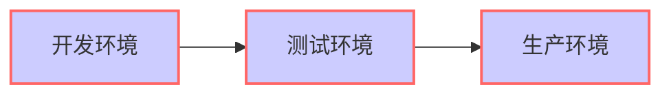

# Django项目的一些最佳实践

Best Practice（最佳实践）：是生产或者管理实践的结果达到最优，并且减少出错的可能性

- 使用pipenv管理项目环境（virtaulenv与真实环境的区别）
- 自定义用户模型（如何自定义用户模型，自定用户模型的优势，及常用方式）
- 优先使用通用类视图（Class-based Generic Views）
- 在系统环境变量中保存敏感信息
- 为不同环境分别配置settings.py文件
- 一定要编写测试用例（django单元测试编写，利用testcase模型类和视图编写测试用例）

## **Pipenv管理项目环境**（D:\github\flaskProject\codes\fisher）

**真实环境**  ***VS*** **virtualenv** ***VS*** **pipenv**

1. **安装pipenv**

   ```shell
   python3 -V
   pip3 -V
   pip3 install pipenv
   ```

   

2. 新建项目目录**

   ```shell
   mkdir myproject 
   cd myproject
   pipenv --python 3.7  #开始创建虚拟环境
   
   
   ```

   使用系统中的3.7版本在当前目录下创建了虚拟环境，**查看虚拟环境创建的目录**，该目录下创建好对应的目录

   `Virtualenv location:`

   

3. 如果需要在这个虚拟环境中安装依赖包的话，只要进入对应的项目目录，直接执行如下命令**

   ```shell
   pipenv install django
   ```

   安装包的过程中会自动生成两个文件，安装过程会有点慢，因为使用官网的pypi配置源

   ***常见问题***

   提示：Pipfile.lock not found, creating....，会自动创建

   查看项目目录

   **Pipfile**   **Pipfile.lock**

   

4. 修改Pipfile**

   ```ini
   [[source]]
   name = "pypi"
   url = "https://pypi.org/simple" 
   verify_ssl = true
   
   [dev-packages]
   
   [packages]
   flask = "*"
   
   [requires]
   python_version = "3.7"
   
   ```

   将url改成功国内pypi镜像源url = "https://mirrors.aliyun.com/pypi/simple/"

   Pipenv.lock文件内容如下：

   ```json
   {
       "_meta": {
           "hash": {
               "sha256": "a82b674d67d29678775ff6b773de1686a9593749ec14483b0d8e05131b662286"
           },
           "pipfile-spec": 6,
           "requires": {
               "python_version": "3.7"
           },
           "sources": [
               {
                   "name": "pypi",
                   "url": "https://pypi.org/simple",
                   "verify_ssl": true
               }
           ]
       },
       "default": {
           "click": {
               "hashes": [
                   "sha256:2335065e6395b9e67ca716de5f7526736bfa6ceead690adf616d925bdc622b13",
                   "sha256:5b94b49521f6456670fdb30cd82a4eca9412788a93fa6dd6df72c94d5a8ff2d7"
               ],
               "version": "==7.0"
           },
           "flask": {
               "hashes": [
                   "sha256:13f9f196f330c7c2c5d7a5cf91af894110ca0215ac051b5844701f2bfd934d52",
                   "sha256:45eb5a6fd193d6cf7e0cf5d8a5b31f83d5faae0293695626f539a823e93b13f6"
               ],
               "index": "pypi",
               "version": "==1.1.1"
           },
           "itsdangerous": {
               "hashes": [
                   "sha256:321b033d07f2a4136d3ec762eac9f16a10ccd60f53c0c91af90217ace7ba1f19",
                   "sha256:b12271b2047cb23eeb98c8b5622e2e5c5e9abd9784a153e9d8ef9cb4dd09d749"
               ],
               "version": "==1.1.0"
           },
           "jinja2": {
               "hashes": [
                   "sha256:065c4f02ebe7f7cf559e49ee5a95fb800a9e4528727aec6f24402a5374c65013",
                   "sha256:14dd6caf1527abb21f08f86c784eac40853ba93edb79552aa1e4b8aef1b61c7b"
               ],
               "version": "==2.10.1"
           },
           "markupsafe": {
               "hashes": [
                   "sha256:00bc623926325b26bb9605ae9eae8a215691f33cae5df11ca5424f06f2d1f473",
                   "sha256:09027a7803a62ca78792ad89403b1b7a73a01c8cb65909cd876f7fcebd79b161",
                   "sha256:09c4b7f37d6c648cb13f9230d847adf22f8171b1ccc4d5682398e77f40309235",
                   "sha256:1027c282dad077d0bae18be6794e6b6b8c91d58ed8a8d89a89d59693b9131db5",
                   "sha256:24982cc2533820871eba85ba648cd53d8623687ff11cbb805be4ff7b4c971aff",
                   "sha256:29872e92839765e546828bb7754a68c418d927cd064fd4708fab9fe9c8bb116b",
                   "sha256:43a55c2930bbc139570ac2452adf3d70cdbb3cfe5912c71cdce1c2c6bbd9c5d1",
                   "sha256:46c99d2de99945ec5cb54f23c8cd5689f6d7177305ebff350a58ce5f8de1669e",
                   "sha256:500d4957e52ddc3351cabf489e79c91c17f6e0899158447047588650b5e69183",
                   "sha256:535f6fc4d397c1563d08b88e485c3496cf5784e927af890fb3c3aac7f933ec66",
                   "sha256:62fe6c95e3ec8a7fad637b7f3d372c15ec1caa01ab47926cfdf7a75b40e0eac1",
                   "sha256:6dd73240d2af64df90aa7c4e7481e23825ea70af4b4922f8ede5b9e35f78a3b1",
                   "sha256:717ba8fe3ae9cc0006d7c451f0bb265ee07739daf76355d06366154ee68d221e",
                   "sha256:79855e1c5b8da654cf486b830bd42c06e8780cea587384cf6545b7d9ac013a0b",
                   "sha256:7c1699dfe0cf8ff607dbdcc1e9b9af1755371f92a68f706051cc8c37d447c905",
                   "sha256:88e5fcfb52ee7b911e8bb6d6aa2fd21fbecc674eadd44118a9cc3863f938e735",
                   "sha256:8defac2f2ccd6805ebf65f5eeb132adcf2ab57aa11fdf4c0dd5169a004710e7d",
                   "sha256:98c7086708b163d425c67c7a91bad6e466bb99d797aa64f965e9d25c12111a5e",
                   "sha256:9add70b36c5666a2ed02b43b335fe19002ee5235efd4b8a89bfcf9005bebac0d",
                   "sha256:9bf40443012702a1d2070043cb6291650a0841ece432556f784f004937f0f32c",
                   "sha256:ade5e387d2ad0d7ebf59146cc00c8044acbd863725f887353a10df825fc8ae21",
                   "sha256:b00c1de48212e4cc9603895652c5c410df699856a2853135b3967591e4beebc2",
                   "sha256:b1282f8c00509d99fef04d8ba936b156d419be841854fe901d8ae224c59f0be5",
                   "sha256:b2051432115498d3562c084a49bba65d97cf251f5a331c64a12ee7e04dacc51b",
                   "sha256:ba59edeaa2fc6114428f1637ffff42da1e311e29382d81b339c1817d37ec93c6",
                   "sha256:c8716a48d94b06bb3b2524c2b77e055fb313aeb4ea620c8dd03a105574ba704f",
                   "sha256:cd5df75523866410809ca100dc9681e301e3c27567cf498077e8551b6d20e42f",
                   "sha256:e249096428b3ae81b08327a63a485ad0878de3fb939049038579ac0ef61e17e7"
               ],
               "version": "==1.1.1"
           },
           "werkzeug": {
               "hashes": [
                   "sha256:87ae4e5b5366da2347eb3116c0e6c681a0e939a33b2805e2c0cbd282664932c4",
                   "sha256:a13b74dd3c45f758d4ebdb224be8f1ab8ef58b3c0ffc1783a8c7d9f4f50227e6"
               ],
               "version": "==0.15.5"
           }
       },
       "develop": {}
   }
   ```

   包的哈希值、版本和一些依赖信息，哈希值可以检验包的安全性

   

5. 显示包与包之间的依赖关系**

   ```shell
   pipenv graph
   ```

   每次使用pipenv install 安装包时，会自动更新Pipfile

   

6. 通过参数跳过更新Pipfile**

   ```shell
   pipenv install requests  --skip-lock
   ```

   

7. **通过命令进入虚拟环境**

   ```shell
   pipenv shell    #进入我们创建的虚拟环境，一定要在项目目录下
   ```

   

8. 在虚拟环境下执行pip命令查看当前环境的已安装的包**

   ```shell
   pip list
   ```

   

9. 退出虚拟环境**

   ```shell
   exit
   ```

   

10. 在开发环境安装（dev）单元测试库**

    ```shell
    pipenv install --dev pytest --skip-lock
    ```

    查看Pipfile文件，该依赖会显示在[dev-packages]项目下

    

11. **定位项目的路径**

    ```shell
    pipenv --where
    ```

    

12. **定位虚拟环境保存的路径**

    ```shell
    pipenv --venv
    ```

    

13. **定位python解释器的路径**

    ```shell
    pipenv --py
    ```

    

14. **更新所有的依赖包**

    ```shell
    pipenv update
    ```

    

15. **检查包的安全漏洞**

    ```shell
    pipenv check
    ```

    

16. **删除虚拟环境**

    ```shell
    pipenv --rm
    ```

    

17. **Pipenv优势：**

    结合了pip和virtualenv，并且不在需要，每次安装和卸载包都不需要激活虚拟环境，直接进入项目的目录

18. 


***[在线练习](http://rootnroll.com/d/pipenv)***

[Pipenv playground]: http://rootnroll.com/d/pipenv	"url"


## **用户定义模型**

django最方便的一点就是自带用户系统，不过在有点情况下并不符合项目的需求，原因如下：

- 需要自定义一些字段或者删除django用户系统自带的一些字段
- 定义用户必填字段
- 定义权限相关的字段以上三点自定义用户模型是最常见的需求，做法如下

继承BaceUserManager和AbstractBaseUser，

指定AUTH_USER_MODEL（在settings.py中配置，指定用户的模型类）

AbstractUser本身继承了AbstractBaseUser，PermissionsMixin

定义权限相关的

```python

#继承AbstractBaseUser控制用户的创建过程
from __future__ import unicode_literals

from django.utils.encoding import python_2_unicode_compatible
from django.contrib.auth.models import AbstractUser, BaseUserManager
from django.db import models
from django.urls import reverse

from bootcamp.notifications.models import Notification

@python_2_unicode_compatible
class User(AbstractUser):

    def has_perm(self, perm, obj=None):
        """用户具体的权限"""
        pass

    def has_module_perms(self, app_lable):
        """用户具有访问哪些用用的权限"""
        pass
    def is_staff(self):
        """管理员权限"""
        pass
    #需要在用户模型中把用户管理类关联起来,用户管理类需要放在用户模型类前面
    objects = MyUserManager()
    

class MyUserManager(BaseUserManager):
    def create_user(self, username, password=None):
        """创建用户的函数"""
        pass
        return user
    def create_superuser(self, username, password=None):
        """创建超级用户"""
        pass
        return user
   

```

以上两个函数是新建项目的时候，通过manage.py create user和manage.py create superuser，如果在上面的字段新增必填字段，创建的时候就会显示


## **优先使用通用类视图（Class-based Generic Views）**


**函数视图 (FBV)**

通过条件和分支方式来分别响应不同的HTTP请求，函数式编程是面向过程的，代码的复用率很低


**类视图 (CBV)**

```python
from django.views.generic import View

class MyView(View):
    def get(self, request, *args, **kwargs):
        pass
    def post(self, request, *args, **kwargs):
        pass
    
#然后在url中定义要解析的路径(在包目录下的urls.py中定义解析的路径)
from django.urls import path
from project_name.package_name.views import (
    user_list_view,
    MyView,
)

app_name = 'package_name'
urlpatterns = [
    path("myview/", view=MyView.as_view(), name="myview");
]
    
#所有基于类的视图都有一个as_view方法，用来作为类调用的入口，在这个入口中可以传递一些参数，在这里传递的参数只在url第一次导入时配置生效，相当于全局的属性，as_view方法作为入口点，它会创建类的实例，调用dispatch方法，dispatch方法首先判断我们的请求方法是否在http_method_names中，http_method_names中定义http请求的常见8中方式，也就是在使用类视图中定义的方法必须是http_method_names中定义的，如果不存在的话，就会抛出请求不允许，然后记录日志

```

类视图的核心是通过不同的类实例方法来响应不同的http请求

使用类视图和函数视图对比最重要的一点是面向对象，python类特性有封装、继承、多态；并且支持多继承的

***注意***：

继承自多个父类的话，只有一个父类继承自View，其他的父类都是Mixin


**通用类视图 (CBGV)**

web开发增删改查肯定是基本需求，如果一直使用类视图，多少感觉有点重复，能不能把这些重复的方法模式抽象出来，来写更少的代码实现常见的增删改成操作，于是就有了通用类视图，最佳实践是使用通用类视图。

django-cookiecutter生成项目，使用通用类视图

```
class UserDetailView(LoginRequiredMixin, DetailView):
    pass
    
class UserUpdateView(LoginRequiredMixin, UpdateView):

```

常见的增删改查都有对应公用类视图，作为View的子类


**django通用类视图学习**

[django通用类视图学习网站](http://ccbv.co.uk/)


## **在系统环境变量中保存敏感信息**

项目中的敏感信息需要跟代码分离，django开发中重点（敏感文件）settings.py中的文件，也就是django应用的配置，可以依据Twelve-Factor方法论为djano应用配置环境变量。

[Twelve-Factor]( https://www.12factor.net/zh_cn/ )

使用环境变量存储敏感信息的好处是

- 更方便地进行版本控制（因为所有的代码中没有密码相关的配置），这样就不需要关心.gitconfig文件是否有添加
- 每次部署变更的时候不需要再改配置信息

django上的实践

1. 安装django-environ

   ```shell
   pipenv install django-environ --skip-lock
   ```

   config-》settings-》base.py、local.py、production.py、test.py

   分别对应开发环境、生产环境、测试环境，base.py是三个环境共有的基本配置

   base.py文件中导入import environ

   在项目目录下有一个.env文件，定义django项目的绝大多数配置和敏感信息

   然后在开发环境、生产环境、测试环境都通过

   from .base import env  #通过.env文件来获取相关的配置

   这样就实现了将应用的配置和代码分离

   ***虚拟环境中运行django开发服务***

   ```shell
   pipenv run python manage.py runserver 0.0.0.0:8000
   ```


## **为不同环境分别配置settings.py文件**



```python
from .base import * #在python中使用*是非常不明智的做法，但是这里是合法，也是唯一合理的地方，这样可以覆盖base.py中的所有命令
from .base import env
```

cookiecutter搭建项目时会自动生成

pipenv是可以对不同环境进行分组的，Pipfile


## **一定要编写测试用例**

单元测试绝对不是浪费时间的无用功，它是高质量代码的保障之一。

python中单元测试有哪些最佳实践

1. 每个模块目录下都有一个tests目录
2. tools--》Run manage.py Task
3. test  #相当于进入项目的虚拟开发环境，并运行python manage.py test 
4. 自动创建一个测试数据库
5. 理论上视图、路由、模型、表单、应用都要测试
6. 为每个类中的方法都编写测试用例
7. 写测试用例功能点要最小化（每个函数只测试一个功能点）函数名必须都是以 **”test_“** 开始
8. 测试用例编写要尽可能简单
9. 提交代码前都需要执行一下测试用例通过后，在提交代码

**python测试覆盖率**

1. 安装测试覆盖率包

   ```shell
   pipenv install coverge --skip-lock
   ```

   

2. 使用coverage执行测试用例

   ```shell
   pipenv run coverage run manage.py test -v 2
   ```

   

3. 生成测试报告

   ```shell
   pipenv run coverage html
   ```

   生成**htmlcov**

   

4. 下载htmlcov，查看index.html

   


