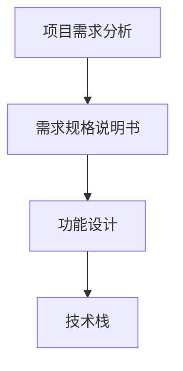
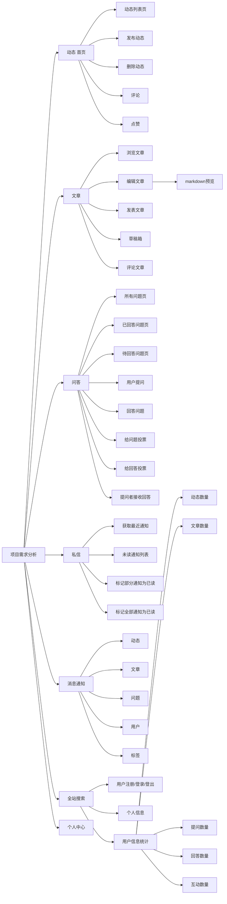
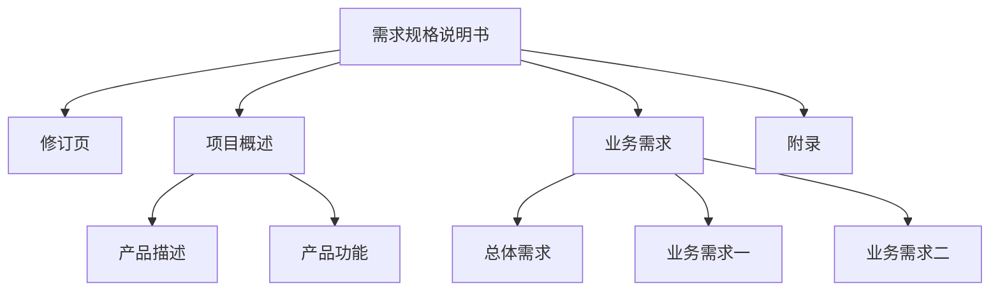
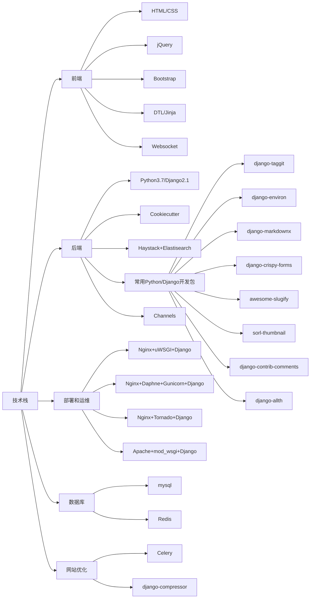

# 需求分析 功能设计 技术选型	

根据企业的开发流程和规范，先对项目进行需求分析，设计好要开发的每一个功能点，然后确定要使用的技术栈。（解决问题的方法和思路）

将用户角度的需求转换为程序员要写的代码是一个非常严谨的过程，

**项目需求分析**

可以将一个复杂的问题按功能进行分解，并逐渐细化，（参考[知乎](https://www.zhihu.com/)、[思否](https://segmentfault.com/)）

**首页**有不同用户发送的动态、动态下面可以点赞、评论、分享、收藏、感谢....

对于用户自己发表的动态，可以编辑、删除

**文章**

**回答**

**私信**

**全站搜索功能**

**用户个人中心**

**需求规格说明书**

**功能设计**

遵循低耦合，高内聚架构设计思想，应该如何设计来发流程和业务逻辑

**技术选型**

为什么使用DTL模板？

- 使用Cookiecutter生成的模板默认使用DTL

- django常用库支持者DTL模板

  