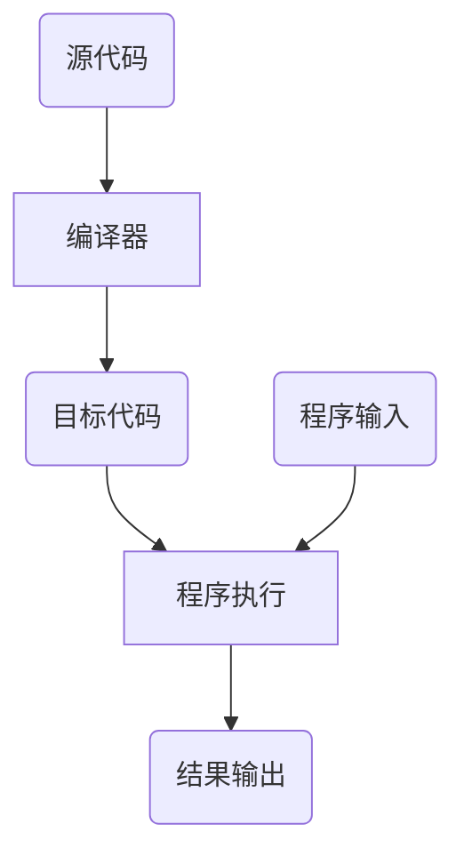
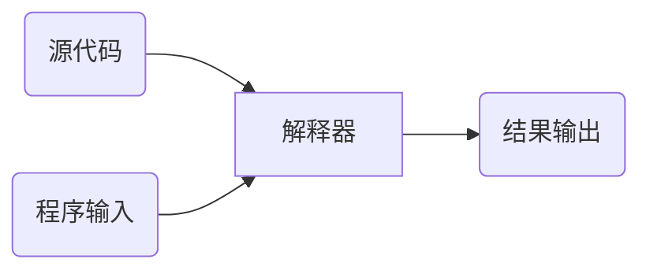

# python语言程序设计

## 第1章  Python基本语法元素

- 方法论 -- 程序的基本编写方法：IPO

- 实践能力 -- 看懂10行左右简单python代码


**计算机的概念**

功能性：对数据的操作，表现为数据计算、输入输出处理和结果存储等

可编程性：根据一系列指令自动地、可预测地、准确地完成操作者的意图


编程语言按照执行方式类划分：编译和解释

源代码：采用某种编程语言编写的计算机程序，人类可读

目标代码：计算机可直接执行，人类不可读

编译：将源代码一次转换成目标代码的过程，一次性翻译，之后不再需要源代码



解释：将源代码逐条转换成目标代码同时逐条运行的过程

执行解释过程的程序叫作解释器，每次程序运行时边翻译边执行



两种不同的执行源代码的方式，就带来了不同的程序实现的方式，根据这两种执行方式的不同，可以将编程语言分成两类，一类叫静态语言；一类叫动态语言

- 静态语言：使用编译执行的编程语言（C/C++,Java）
- 脚本语言：使用解释器执行的编程语言（python、javascript、php）


**程序的基本编写方法**

- I ：Input输入，程序的输入
- P：Process处理，程序的主要逻辑
- O：Output输出，程序的输出

输入：程序的输入

文件输入、网络输入、控制台输入、交互界面输入、内部参数输入等等

输出：程序的输出

控制台输出、图形输出、文件输出、网络输出、操作系统内部变量输出等

输出时程序展示运算结果的方式

处理：

处理是程序对输入数据进行计算产生输出结果的过程

处理方法统称为算法，它是程序最重要的部分


编程解决问题的步骤

6个步骤：

分析问题：分析问题的计算部分

划分边界：划分问题的功能边界，规划IPO

设计算法：设计问题的求解算法

编写程序：编写问题的计算程序

调试测试：

升级维护：


精简步骤：

确定IPO

编写程序

调试程序


实例2：同切圆绘制，绘制多个同切圆

```python
In [4]: import turtle

In [5]: turtle.pensize(2)

In [6]: turtle.circle(10)

In [7]: turtle.circle(40)

In [8]: turtle.circle(80)

In [9]: turtle.circle(160)
```

实例3：五角星绘制

```python
In [1]: from turtle import *
In [2]: color('red', 'red')
In [3]: for i in range(5):
   ...:     fd(200)
   ...:     rt(144)
In [5]: end_fill()
In [6]: done()
```


实例4：温度转换

温度刻画的两种不同体系

- 摄氏度：以1标准大气压下水的结冰点为0度，沸点为100度，将温度进行等分刻画

- 华氏度：以1标准大气压下水的结冰点为32度，沸点为212度，将温度进行等分刻画

  

  两种温度体系的转换

- 摄氏度C转换为华氏度F

- 华氏度F转换为摄氏度C

  利用转换公式如下：
  $$
  C = (F - 32)/1.8 
  $$

  $$
  F = C * 1.8 + 32
  $$

  C表示摄氏温度，F表示华氏温度

```python
#TempConvert.py
TempStr = input("请输入带有符号的温度值:")
if TempStr[-1].lower() == 'f':
    C = (eval(TempStr[0:-1])-32)/1.8
    print("转换后的温度是{:.2f}C".format(C))
elif TempStr[-1].lower() == 'c':
    F = eval(TempStr[0:-1])*1.8+32
    print("转换后的温度是{:.2f}F".format(F))
else:
    print("输入格式错误")
```


